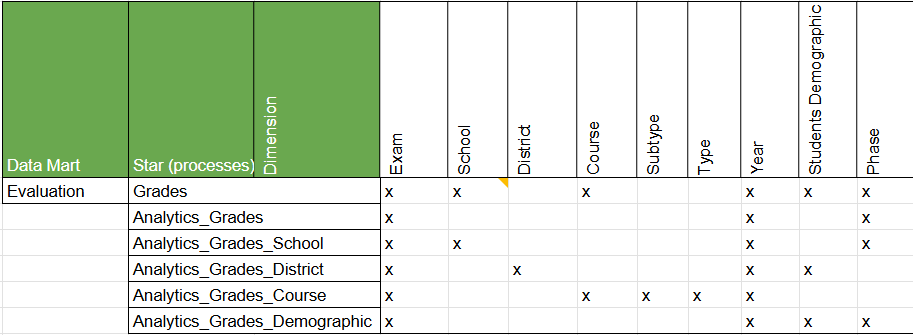
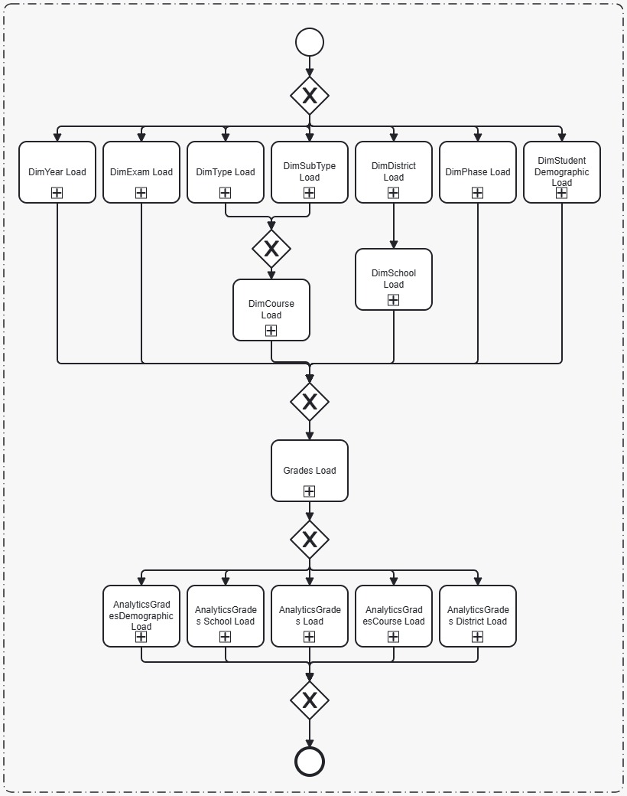
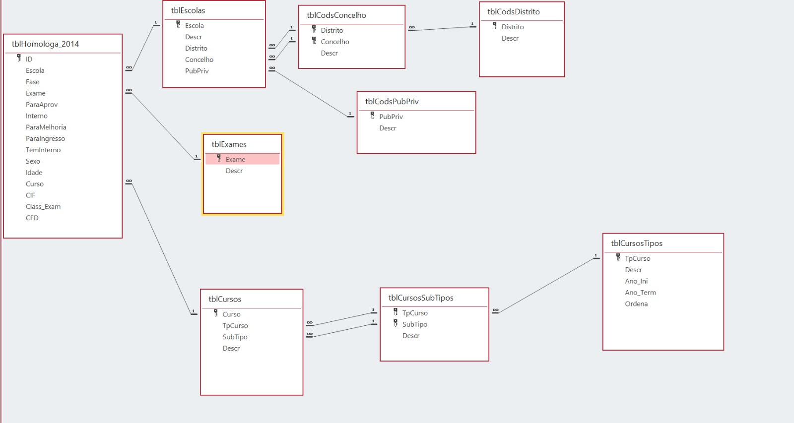

# National Exams Data Warehouse Project

This repository contains a data warehouse solution for analyzing national exam results in Portugal. The project includes ETL scripts, database models, and PowerBI dashboards for visualizing exam performance across different dimensions.


# Abstract

This work presents the design, implementation, and evaluation of a data warehouse for Portuguese national examination results. Transforming approximately one million examination records from 2013-2014 from an operational database into a dimensional model, the project demonstrates how a star schema design significantly enhances analytical capabilities for educational data. The dimensional model consists of six fact tables and nine dimension tables, enabling multi-perspective analysis across schools, districts, courses, and demographics. Comparative query performance testing reveals substantial improvements, with analytical queries executing up to 215 times faster in the dimensional model compared to the relational model. Interactive Power BI dashboards provide visualizations from general, school-specific, and geographic perspectives, revealing significant insights including regional performance patterns and school type differences. The project concludes by discussing the advantages of dimensional modeling for analytical workloads and suggesting future developments including cloud-native data warehousing and AI/ML integration for predictive analytics in educational contexts.


*Dimensional model for the national exams data warehouse*



*Bus matrix and facts/dimensions dictionary*

## Repository Contents

### Documentation and Diagrams
- [`UML_Dimensional_Model.png`](UML_Dimensional_Model.png) - Data warehouse dimensional model diagram  
- [`BPMN2.0_ETL.jpeg`](BPMN2.0_ETL.jpeg) - Business Process Model for the ETL workflow  
- [`Operational_model.jpeg`](Operational_model.jpeg) - Operational database model  
- [`Report_DW_National_Exams.pdf`](Report_DW_National_Exams.pdf) - Detailed project report  

### ETL Scripts
- [`Initial_transaction_loading_exam/`](Initial_transaction_loading_exam/) - Initial scripts and CSV files to load the operational/transactional model into PostgreSQL
- [`ETL_Scripts/proj_etl.sql`](ETL_Scripts/proj_etl.sql) - SQL script that creates the data warehouse schema and performs data extraction, transformation, and loading  
- [`ETL_Scripts/python_run.py`](ETL_Scripts/python_run.py) - Python script to execute the SQL ETL process 


*Business Process Model for the ETL workflow*

### Dashboard Visualizations


*Overall exam performance metrics*


*Exam analysis by geographic districts*


*School-level performance analysis*

### Data Files
- [`Dicts_Bus_Exams.xlsx`](Dicts_Bus_Exams.xlsx) - Bus matrix and facts/dimensions dictionarys 

## About the Project

This data warehouse project focuses on analyzing national exam results (ENES) from 2013 and 2014. The dimensional model includes facts about student grades across various dimensions such as schools, courses, demographics, and geographic regions.

Data source: https://www.dge.mec.pt/relatoriosestatisticas-0

## Operational Model

The operational model represents the original transactional database structure used to store national exam records before transformation into the data warehouse. It typically includes normalized tables for students, schools, courses, exams, and results, optimized for data integrity and transactional processing.



*Operational database model for national exam records*
## Running the ETL Process


To run the ETL process:

1. Ensure PostgreSQL is installed and accessible  
2. Configure the database connection in [`ETL_Scripts/python_run.py`](ETL_Scripts/python_run.py)  
3. Run the Python script:
   ```bash
   cd ETL_Scripts
   python python_run.py
   ```

## PowerBI Dashboard

A PowerBI file provides interactive visualizations of:
- Overall exam performance metrics  
- Geographic analysis by district and region  
- School-level performance comparisons  
- Demographic analysis of student performance  
- Course type and subject analysis  

The screenshots in the PowerBI Dashboards Prints folder show examples of these visualizations.

You can open the `exams_dashboard.pbix` file locally if you have PowerBI Desktop installed.

